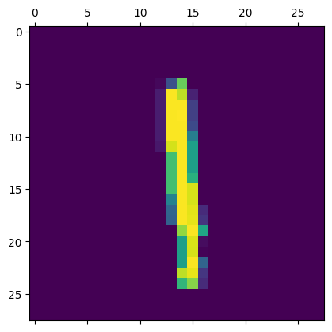

# Handwritten Digit Recognition (MNIST)



## Overview
This project focuses on recognizing handwritten digits. It achieves an accuracy of 98% in digit classification.

## Dataset
The MNIST dataset consists of a large collection of 28x28 pixel grayscale images of handwritten digits (0 through 9). It serves as a benchmark in the field of machine learning and computer vision.

## Requirements
Make sure you have the following dependencies installed:

- numpy
- seaborn
- tensorflow
- matplotlib
- scikit-learn

You can install these libraries using pip:

```bash
pip install -r requirements.txt
