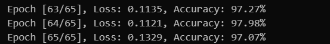
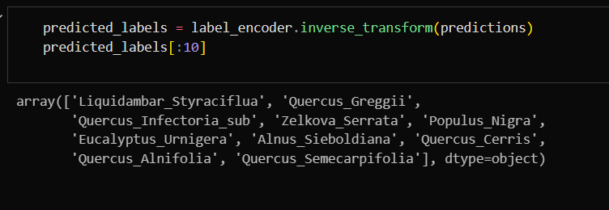

# Image Classification Model with MobileNetV2

This project demonstrates the creation of an image classification model using a pre-trained **MobileNetV2** architecture. The model is designed to classify images into predefined categories and includes an example of how to classify a sample image with added Gaussian noise for robustness.

## About

Image classification is a key task in computer vision, aiming to assign a label to an image based on its content. This project utilizes a pre-trained MobileNetV2 model to classify images into specified categories. The dataset used consists of images with associated labels, making it suitable for benchmarking classification algorithms.

## Features

- **Multi-class Classification:** Classifies images into multiple predefined categories.
- **Data Augmentation:** Incorporates techniques like Gaussian noise addition for improved robustness.
- **Sample Image Testing:** Option to test the model with a sample image for quick evaluations.

## Prerequisites

To run this code, ensure you have the following libraries installed:

- **PyTorch**
- **NumPy**
- **Pandas**
- **Pillow**
- **scikit-learn**
- **torchvision**

You can install the required libraries using the following command:

```bash
pip install torch torchvision numpy pandas Pillow scikit-learn
```

## Dataset

The Kaggle dataset has been used for this project. Learn more about the dataset at:  
[Leaf Classification Dataset on Kaggle](https://www.kaggle.com/c/leaf-classification/data)

## Results
- Model train accuracy


- Test results of first 10 images in test dataset


## Acknowledgments

This project serves educational purposes and illustrates image classification using pre-trained models. The MobileNetV2 architecture is a widely recognized model for efficient image classification tasks.
