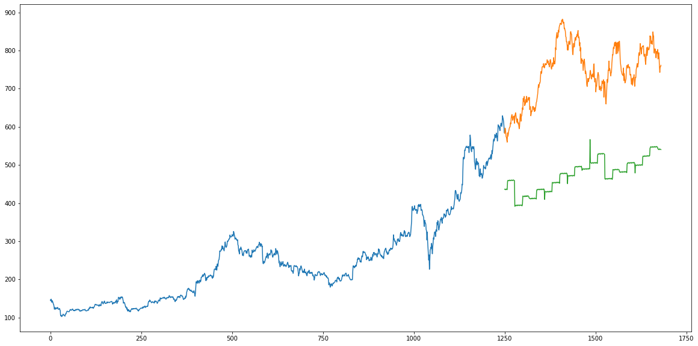
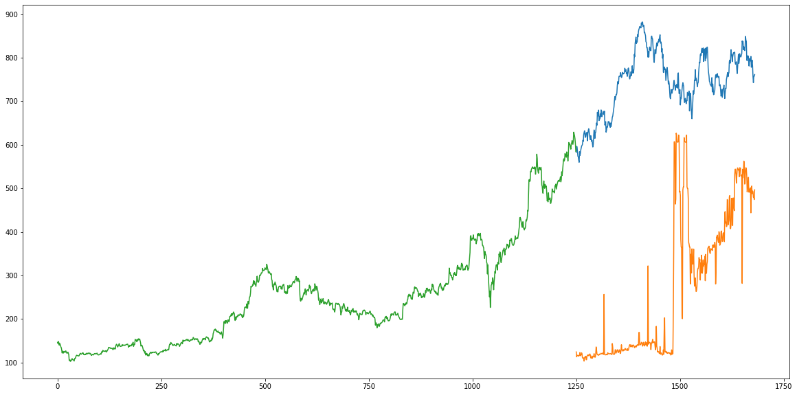
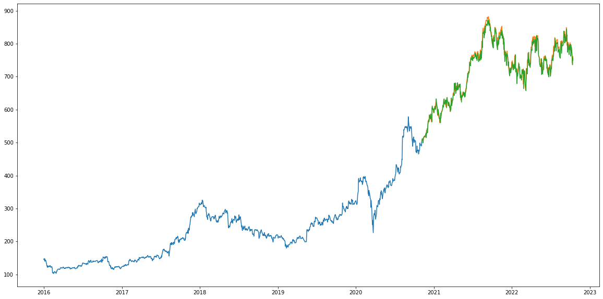

  <h1>TATA Consumer Stock Predicition</h1>
  

### Goal

The goal of this project is to predict stock market price for "TATA Consumer"/"TATA" stock.

### Dataset

The dataset has been scraped by me from NSEINDIA.
It has data of TATA Consumer Stock from 2016-01-01 to 2022-10-14.

Here is the link for the dataset: https://docs.google.com/spreadsheets/d/1K54RgdRkLy52DloI0BKs4X5WgmHQ40hhkKsqH4XYx8Q/edit?usp=sharing that was used.

### What Have I Done?

- Imported all the required libraries and dataset for this project.
- Done some pre-processing on Dataset
- Split the Dataset into Training & Testing
- Used the Following Models:
  - Linear Regression Model
  - KNN Model
  - LSTM
- Visualize the Prediction vs Actual Curve
- Check the RMS

### Libraries Used:

- tensorflow
- matplotlib
- numpy
- sklearn
- fastai
- pandas

### Model 1 - Linear Regression:

### Model 2 - KNN:

### Model 3 - LSTM:

### RMS

Model 1: 276.5740533652191

Model 2: 504.83763222168034

Model 3: 13.895383486628365

## Conclusion

We can thus predict to high degree of accuracy of tata consumer stock using day's close price.

### Author

Code Contributed by: Kunal Agrawal

Github: kunalagra
